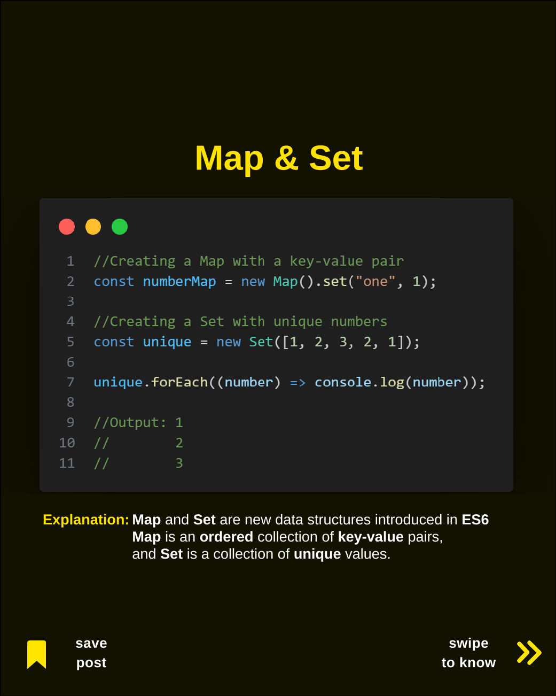
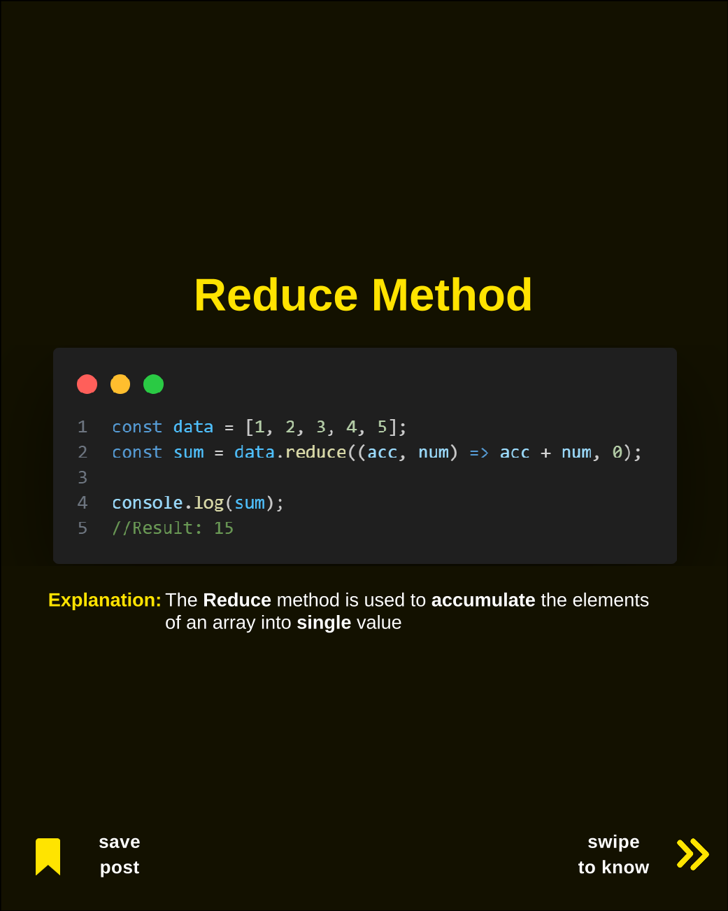
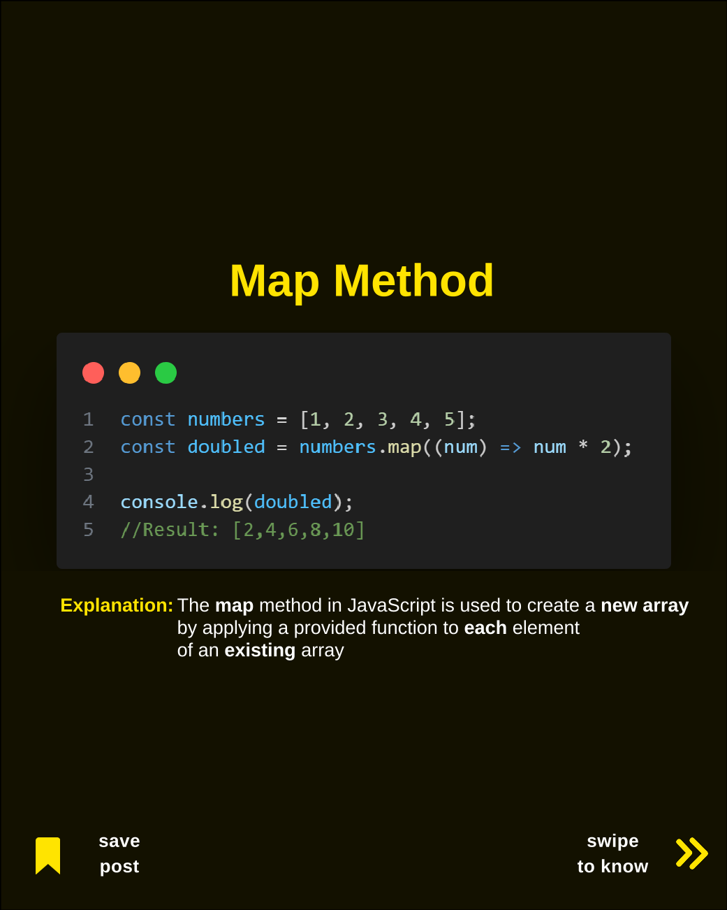
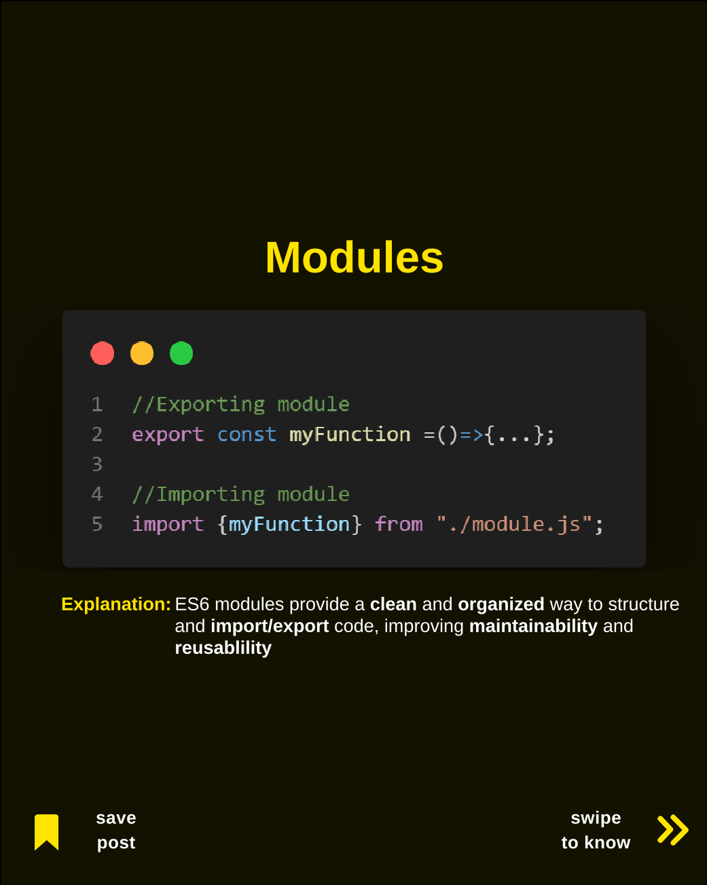
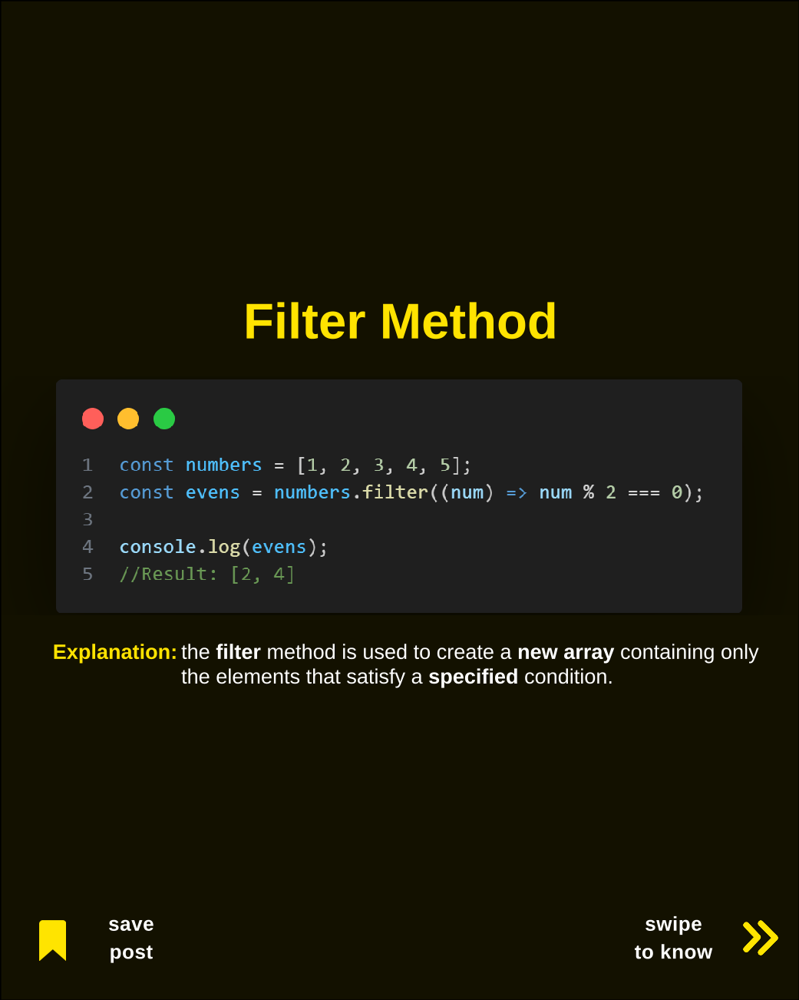

# Listado de Imágenes PNG

## 1. **Async Await**

Async_Await.

## 2. **Map & Set**

Map_&_Set.

## 3. **Default_Parameters**

Default_Parameters.

## 4. **Reduce Method**

Reduce_Method.

## 5. **Map Method**

Map_Method.

## 6. **Modules**

Modules.

## 7. **filter**

filter.

## 8. **js-array-obj-flatMap**

js-array-obj-flatMap.
